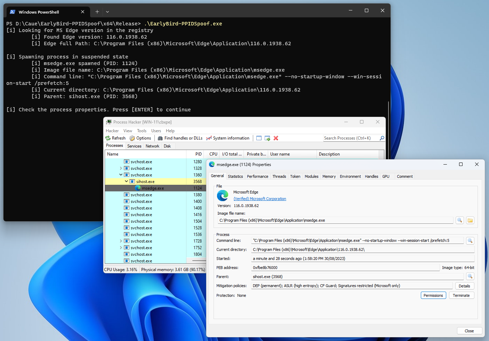

# EarlyBird-EdgeCase
Early Bird injection retrieving the version of MS Edge from the registry.  
Code for the [post here](https://caueb.com/purple-team-lab/earlybirdedgecase/).

## Features
1. Get the target process PID comparing name and checking if integrity is MEDIUM.
2. Open a handle to the target process (used for the PPID spoofing).
3. Fetch MS Edge version from the registry (used in the "Current directory" of the spawned process).
4. Perform Early Bird injection spawning MS Edge with the correct parameters.

### Credits
- [Maldev Academy](https://maldevacademy.com/)  
- [Capt. Meelo - Picky PPID Spoofing](https://captmeelo.com/redteam/maldev/2021/11/22/picky-ppid-spoofing.html)

